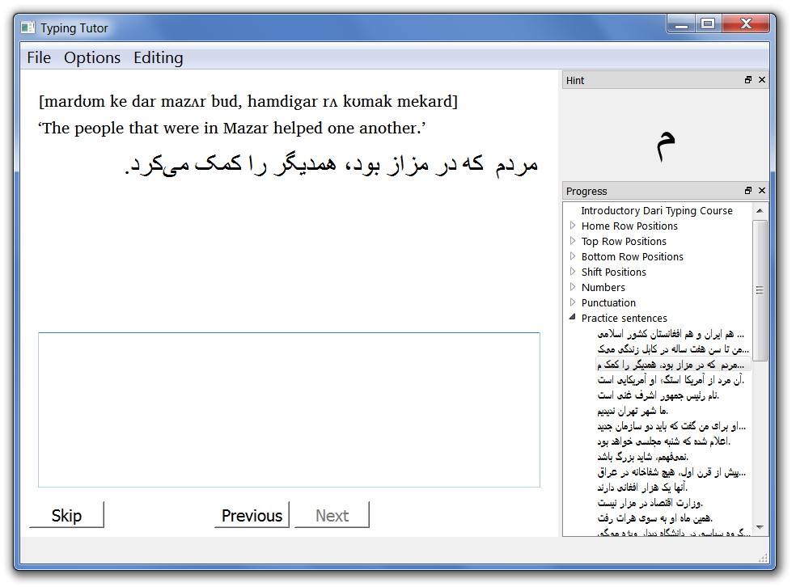

Introduction
------------

If you're trying to design lessons for people to learn to type in a minority language, or even just a language without a lot of computing resources, this is the software for you. You can create typing tutorials for people to work through. Best of all, it's completely independent of language and input method. It should be no more difficult to create lessons for Chinese or Persian or Hindi than for English or Spanish.



Instructions—User's Perspective
-------------------------------

*   Launch the program
*   Do File | Open course... and select (for instance) “persian-typing.xml”—this file is included as a demonstration.
*   Follow the instructions; “Next,” “Previous,” and “Skip” work as usual.
*   After you've typed the thing correctly, hit Spacebar to move on to the next slide.
*   The prompt window at the upper right tells you the next letter you need to type.
*   If you get it wrong, your incorrect text is highlighted. You'll also get a hint about how to produce the letter.
*   Click around the tree on the right to move around to different parts of the course.

Instructions—Instructor's Perspective
-------------------------------------

*   Review the instructions above, and look at the lessons in “persian-typing.xml.” This is a lesson for English speakers who want to learn to type Persian.
*   Go to Editing | Edit course content.... You can navigate among different elements.
    *   There is an introductory slide, the different sections of the course, and the concluding slide.
    *   When you click on the introduction and conclusion you can modify the “Heading” and “Description” fields. These are places to help your learners understand the logic of the lessons.
    *   Right-click on a blank space or a section title and click “Insert section” to insert a section.
    *   Right-click on a section and click “Remove section” to remove a section.
    *   A prompt is something that a learner sees and has to type. It a place for introductory text so you can give your users specific instructions. In the sample course, translations and pronunciations of the prompts are sometimes given.
    *   Right-click on a section or a prompt and click “Insert prompt” to add a new prompt.
    *   Right-click on a prompt and click “Remove prompt” to remove a prompt.
    *   You can drag-and-drop to reorder sections or prompts, or to move prompts to different sections.
*   Go to Editing | Edit keyboard.... to look at how the keyboard is defined. This is a really, _really_ important thing for your course. This program works for any language because _everything_ has to be specified here.
    *   You can give the keyboard a name if you wish. The user never sees this, but it might be helpful for you.
    *   On the left is a list of every _unicode string_ the user can enter. This is not quite the same as a letter, and not quite the same as a glyph.
    *   The “Unicode Text” is the text of a letter.
        *   If your language has uppercase and lowercase, then you would need to include ‘A’ ‘B’ ‘C’... and ‘a’ ‘b’ ‘c’... separately.
        *   If your language has joining characters where the computer takes care of it by itself, you only have to include each letter once (e.g, ... آ، ا،‌ ب،‌ پ،‌ ت، ث، ج).
        *   If your language has different contextual forms where the user decides (e.g., Hebrew final/non-final letters), then you do need to include those separately. (e.g., פ ף כ ך נ ן)
        *   You need to remember to add whatever punctuation your keyboard can produce as well (e.g., spaces, or whatever you use).
        *   If you have to hit a bunch of keys in sequence to produce 機, then you should enter in 機. (If you have a logographic alphabet, you want to open up the XML file and figure out how to do that automatically!)
    *   The “Hint” is what your learner will see if s/he types the wrong thing. What you type in here will vary depending on your learners. _“q” on an English keyboard_ is a good hint for an English speaker learning to type a Persian ض, but it's not a very good hint for a Persian speaker!
    *   The “Prompt Text” is what your learner will see in that upper-right corner.
        *   This feature is most relevant for cursive alphabets, where it may not be obvious what letter is coming next.
        *   For things like spaces and zero-width joiners that are invisible, you may want to type in something like “Sp,” etc.
        *   If you're working with a right-to-left language, it may be necessary to put in an RTL mark (U+200F) to make it appear correctly.
    *   Right-click in the list to either add or remove a letter.
*   Go to Editing | Edit text styles.... to change how text appears.
    *   Choose whether this is a right-to-left or a left-to-right language.
    *   Probably the most important thing here is to make sure that you're displaying your text in an appropriate font. Use the “Choose...” buttons. If you understand the computer code in the boxes, you can edit that; otherwise ignore it.
    *   Click the boxes to choose background and foreground colors for the remainder and error text.
*   The “New course...” and “Save course” commands are under the “Editing” menu since normal users won't be using these.
*   The course is stored in an XML file, and even if you aren't terribly familiar with XML, you might be able to just edit it directly. If you're doing this sort of thing, it's likely you have access to a computer geek who could help you out. Otherwise it'll be a bit tedious.

Absent features
---------------

*   There are no scores for timing or accuracy. Although those things could be added to a future version in principle, it seems inappropriate to burden new learners with such (discouraging) evaluation metrics.
*   The “Skip” button means that users are not held back from different parts of the lesson. If they want to skip around, they can.
*   Enabling randomized repetition seemed like asking for a frustrating experience. The instructor can build repetition and randomness into the lessons at his/her discretion.
*   There is no picture of a keyboard.

Downloads
---------

Typing Tutor is created with the [Qt application framework](https://www.qt.io/), released under the GNU Public License. That means, among other things, that you are free to download it and use it, but not to re-sell it.

Qt is a cross-platform framework, so there is the possibility for using this on Mac OS X, Linux, etc. Right now I only have Windows executables because I only have a Windows machine. Perhaps some do-gooder will build versions for other operating systems and send them to me.

I build in Windows with this, which assumes that Qt is installed and visible in your path:

```
qmake -config release mingw32-make
```

Of course your system would have something different from “mingw32-make”—probably just “make”—if you are not building from Windows using MinGW.
